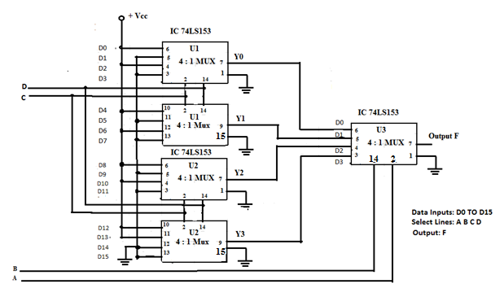
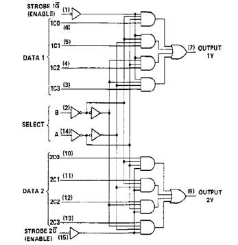
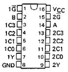
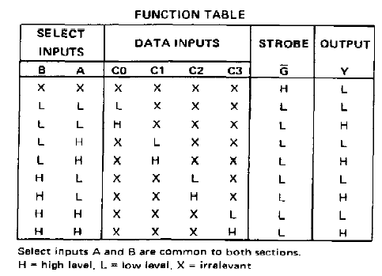
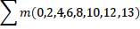

In Experiment # 1 we studied the use of IC 74LS153 as a Dual 4:1 MUX. We required only one IC 74LS153 to design an 8:1 MUX. Now in Experiment # 2 we shall study the application of MUX as a Universal Logic Generator for a four variable system.&nbsp; 
To implement a four variable Universal Function Generator using IC 74LS153, let us follow these steps: 
1.&nbsp;&nbsp; &nbsp;To begin with we shall design a 16:1 MUX using multiple 74LS153 ICs.&nbsp; 
2.&nbsp;&nbsp; &nbsp;IC 74LS153 has two 4:1 MUXes within it. Each MUX has two select lines and four data input lines. So in all eight data inputs D0 to D7 are available from first IC # U1. 
3.&nbsp;&nbsp; &nbsp;Similarly second IC # U2 provides another eight data inputs D8 to D15. Thus in all 16 input lines are now available. 
4.&nbsp;&nbsp; &nbsp;To select one of these 16 data inputs, we need four select lines; let us label them as A B C &amp; D; where A is the most significant bit (MSB) and D is the least significant bit (LSB).&nbsp; 
5.&nbsp;&nbsp; &nbsp;Each IC has 4 select lines.&nbsp; 
6.&nbsp;&nbsp; &nbsp;All eight select lines of U1 and U2 are connected together and labelled as select lines C &amp; D. &nbsp; 
7.&nbsp;&nbsp; &nbsp;To get additional two select lines we introduce the third IC U3. Only one 4:1 MUX of U3 is required. The two select lines of U3 are labelled as A &amp; B.&nbsp; 
8.&nbsp;&nbsp; &nbsp;The strobe inputs 1G&rsquo; &amp; 2G&rsquo; of all the ICs is connected to ground so that all the IC&rsquo;s are enabled for operation. 
9.&nbsp;&nbsp; &nbsp;Thus in all we need three IC&rsquo;s for the design of 4-variable Universal Logic Generator as shown in Fig.1. 
The output function F can be written as: 
F = A&rsquo;.B&rsquo;.Y0 + A&rsquo;.B.Y1 +A.B&rsquo;.Y2 +A.B.Y3

 Fig.1. Four variable - Universal Logic Function Generator 

The function table for Fig.1 is given below. Any four variable logic function can be derived using this circuit.
 

<table border="1" cellspacing="0" class="MsoTableGrid" >
	<tbody>
		<tr>
			<td>
			
Decimal

			</td>
			<td colspan="4">
			
Select Lines

			</td>
			<td>
			
Output

			</td>
		</tr>
		<tr>
			<td>
			
Equivalent

			</td>
			<td>
			
<strong>A</strong>

			</td>
			<td>
			
<strong>B</strong>

			</td>
			<td>
			
<strong>C</strong>

			</td>
			<td>
			
<strong>D</strong>

			</td>
			<td>
			
<strong>Y</strong>

			</td>
		</tr>
		<tr>
			<td>
			
0

			</td>
			<td>
			
0

			</td>
			<td>
			
0

			</td>
			<td>
			
0

			</td>
			<td>
			
0

			</td>
			<td>
			
D0

			</td>
		</tr>
		<tr>
			<td>
			
1

			</td>
			<td>
			
0

			</td>
			<td>
			
0

			</td>
			<td>
			
0

			</td>
			<td>
			
1

			</td>
			<td>
			
D1

			</td>
		</tr>
		<tr>
			<td>
			
2

			</td>
			<td>
			
0

			</td>
			<td>
			
0

			</td>
			<td>
			
1

			</td>
			<td>
			
0

			</td>
			<td>
			
D2

			</td>
		</tr>
		<tr>
			<td>
			
3

			</td>
			<td>
			
0

			</td>
			<td>
			
0

			</td>
			<td>
			
1

			</td>
			<td>
			
1

			</td>
			<td>
			
D3

			</td>
		</tr>
		<tr>
			<td>
			
4

			</td>
			<td>
			
0

			</td>
			<td>
			
1

			</td>
			<td>
			
0

			</td>
			<td>
			
0

			</td>
			<td>
			
D4

			</td>
		</tr>
		<tr>
			<td>
			
5

			</td>
			<td>
			
0

			</td>
			<td>
			
1

			</td>
			<td>
			
0

			</td>
			<td>
			
1

			</td>
			<td>
			
D5

			</td>
		</tr>
		<tr>
			<td>
			
6

			</td>
			<td>
			
0

			</td>
			<td>
			
1

			</td>
			<td>
			
1

			</td>
			<td>
			
0

			</td>
			<td>
			
D6

			</td>
		</tr>
		<tr>
			<td>
			
7

			</td>
			<td>
			
0

			</td>
			<td>
			
1

			</td>
			<td>
			
1

			</td>
			<td>
			
1

			</td>
			<td>
			
D7

			</td>
		</tr>
		<tr>
			<td>
			
8

			</td>
			<td>
			
1

			</td>
			<td>
			
0

			</td>
			<td>
			
0

			</td>
			<td>
			
0

			</td>
			<td>
			
D8

			</td>
		</tr>
		<tr>
			<td>
			
9

			</td>
			<td>
			
1

			</td>
			<td>
			
0

			</td>
			<td>
			
0

			</td>
			<td>
			
1

			</td>
			<td>
			
D9

			</td>
		</tr>
		<tr>
			<td>
			
10

			</td>
			<td>
			
1

			</td>
			<td>
			
0

			</td>
			<td>
			
1

			</td>
			<td>
			
0

			</td>
			<td>
			
D10

			</td>
		</tr>
		<tr>
			<td>
			
11

			</td>
			<td>
			
1

			</td>
			<td>
			
0

			</td>
			<td>
			
1

			</td>
			<td>
			
1

			</td>
			<td>
			
D11

			</td>
		</tr>
		<tr>
			<td>
			
12

			</td>
			<td>
			
1

			</td>
			<td>
			
1

			</td>
			<td>
			
0

			</td>
			<td>
			
0

			</td>
			<td>
			
D12

			</td>
		</tr>
		<tr>
			<td>
			
13

			</td>
			<td>
			
1

			</td>
			<td>
			
1

			</td>
			<td>
			
0

			</td>
			<td>
			
1

			</td>
			<td>
			
D13

			</td>
		</tr>
		<tr>
			<td>
			
14

			</td>
			<td>
			
1

			</td>
			<td>
			
1

			</td>
			<td>
			
1

			</td>
			<td>
			
0

			</td>
			<td>
			
D14

			</td>
		</tr>
		<tr>
			<td>
			
15

			</td>
			<td>
			
1

			</td>
			<td>
			
1

			</td>
			<td>
			
1

			</td>
			<td>
			
1

			</td>
			<td>
			
D15

			</td>
		</tr>
	</tbody>
</table>

 

For the logic diagram &amp; pin diagram, refer Fig.2.&nbsp; The function table for IC 74LS153 is also provided for reference.

 Fig. 2. Internal Structure & Pin Diagram of IC74LS153 

 

 
 
 Fig. 3.Function Table 

#### Numerical:

In 4-variable function, there are 4 select lines i.e. total 16 inputs (24 = 16).  

			<table>
				<tr>
					<th colspan=4>Select Lines</th>
					<th colspan=16>Inputs</th>
					<th>Output</th>
				</tr>
				<tr>
					<th>A</th>
					<th>B</th>
					<th>C</th>
					<th>D</th>
					<th>D0</th>
					<th>D1</th>
					<th>D2</th>
					<th>D3</th>
					<th>D4</th>
					<th>D5</th>
					<th>D6</th>
					<th>D7</th>
					<th>D8</th>
					<th>D9</th>
					<th>D10</th>
					<th>D11</th>
					<th>D12</th>
					<th>D13</th>
					<th>D14</th>
					<th>D15</th>
					<th>Y</th>
				</tr>
				<tr>
					<td>0</td>
					<td>0</td>
					<td>0</td>
					<td>0</td>
					<td>0</td>
					<td>X</td>
					<td>X</td>
					<td>X</td>
					<td>X</td>
					<td>X</td>
					<td>X</td>
					<td>X</td>
					<td>X</td>
					<td>X</td>
					<td>X</td>
					<td>X</td>
					<td>X</td>
					<td>X</td>
					<td>X</td>
					<td>X</td>
					<td>0</td>
				</tr>
				<tr>
					<td>0</td>
					<td>0</td>
					<td>0</td>
					<td>0</td>
					<td>1</td>
					<td>X</td>
					<td>X</td>
					<td>X</td>
					<td>X</td>
					<td>X</td>
					<td>X</td>
					<td>X</td>
					<td>X</td>
					<td>X</td>
					<td>X</td>
					<td>X</td>
					<td>X</td>
					<td>X</td>
					<td>X</td>
					<td>X</td>
					<td>1</td>
				</tr>
				<tr>
					<td>0</td>
					<td>0</td>
					<td>0</td>
					<td>1</td>
					<td>X</td>
					<td>0</td>
					<td>X</td>
					<td>X</td>
					<td>X</td>
					<td>X</td>
					<td>X</td>
					<td>X</td>
					<td>X</td>
					<td>X</td>
					<td>X</td>
					<td>X</td>
					<td>X</td>
					<td>X</td>
					<td>X</td>
					<td>X</td>
					<td>0</td>
				</tr>
				<tr>
					<td>0</td>
					<td>0</td>
					<td>0</td>
					<td>1</td>
					<td>X</td>
					<td>1</td>
					<td>X</td>
					<td>X</td>
					<td>X</td>
					<td>X</td>
					<td>X</td>
					<td>X</td>
					<td>X</td>
					<td>X</td>
					<td>X</td>
					<td>X</td>
					<td>X</td>
					<td>X</td>
					<td>X</td>
					<td>X</td>
					<td>1</td>
				</tr>
				<tr>
					<td>0</td>
					<td>0</td>
					<td>1</td>
					<td>0</td>
					<td>X</td>
					<td>X</td>
					<td>0</td>
					<td>X</td>
					<td>X</td>
					<td>X</td>
					<td>X</td>
					<td>X</td>
					<td>X</td>
					<td>X</td>
					<td>X</td>
					<td>X</td>
					<td>X</td>
					<td>X</td>
					<td>X</td>
					<td>X</td>
					<td>0</td>
				</tr>
				<tr>
					<td>0</td>
					<td>0</td>
					<td>1</td>
					<td>0</td>
					<td>X</td>
					<td>X</td>
					<td>1</td>
					<td>X</td>
					<td>X</td>
					<td>X</td>
					<td>X</td>
					<td>X</td>
					<td>X</td>
					<td>X</td>
					<td>X</td>
					<td>X</td>
					<td>X</td>
					<td>X</td>
					<td>X</td>
					<td>X</td>
					<td>1</td>
				</tr>
				<tr>
					<td>0</td>
					<td>0</td>
					<td>1</td>
					<td>1</td>
					<td>X</td>
					<td>X</td>
					<td>X</td>
					<td>0</td>
					<td>X</td>
					<td>X</td>
					<td>X</td>
					<td>X</td>
					<td>X</td>
					<td>X</td>
					<td>X</td>
					<td>X</td>
					<td>X</td>
					<td>X</td>
					<td>X</td>
					<td>X</td>
					<td>0</td>
				</tr>
				<tr>
					<td>0</td>
					<td>0</td>
					<td>1</td>
					<td>1</td>
					<td>X</td>
					<td>X</td>
					<td>X</td>
					<td>1</td>
					<td>X</td>
					<td>X</td>
					<td>X</td>
					<td>X</td>
					<td>X</td>
					<td>X</td>
					<td>X</td>
					<td>X</td>
					<td>X</td>
					<td>X</td>
					<td>X</td>
					<td>X</td>
					<td>1</td>
				</tr>
				<tr>
					<td>0</td>
					<td>1</td>
					<td>0</td>
					<td>0</td>
					<td>X</td>
					<td>X</td>
					<td>X</td>
					<td>X</td>
					<td>0</td>
					<td>X</td>
					<td>X</td>
					<td>X</td>
					<td>X</td>
					<td>X</td>
					<td>X</td>
					<td>X</td>
					<td>X</td>
					<td>X</td>
					<td>X</td>
					<td>X</td>
					<td>0</td>
				</tr>
				<tr>
					<td>0</td>
					<td>1</td>
					<td>0</td>
					<td>0</td>
					<td>X</td>
					<td>X</td>
					<td>X</td>
					<td>X</td>
					<td>1</td>
					<td>X</td>
					<td>X</td>
					<td>X</td>
					<td>X</td>
					<td>X</td>
					<td>X</td>
					<td>X</td>
					<td>X</td>
					<td>X</td>
					<td>X</td>
					<td>X</td>
					<td>1</td>
				</tr>
				<tr>
					<td>0</td>
					<td>1</td>
					<td>0</td>
					<td>1</td>
					<td>X</td>
					<td>X</td>
					<td>X</td>
					<td>X</td>
					<td>X</td>
					<td>0</td>
					<td>X</td>
					<td>X</td>
					<td>X</td>
					<td>X</td>
					<td>X</td>
					<td>X</td>
					<td>X</td>
					<td>X</td>
					<td>X</td>
					<td>X</td>
					<td>0</td>
				</tr>
				<tr>
					<td>0</td>
					<td>1</td>
					<td>0</td>
					<td>1</td>
					<td>X</td>
					<td>X</td>
					<td>X</td>
					<td>X</td>
					<td>X</td>
					<td>1</td>
					<td>X</td>
					<td>X</td>
					<td>X</td>
					<td>X</td>
					<td>X</td>
					<td>X</td>
					<td>X</td>
					<td>X</td>
					<td>X</td>
					<td>X</td>
					<td>1</td>
				</tr>
				<tr>
					<td>0</td>
					<td>1</td>
					<td>1</td>
					<td>0</td>
					<td>X</td>
					<td>X</td>
					<td>X</td>
					<td>X</td>
					<td>X</td>
					<td>X</td>
					<td>0</td>
					<td>X</td>
					<td>X</td>
					<td>X</td>
					<td>X</td>
					<td>X</td>
					<td>X</td>
					<td>X</td>
					<td>X</td>
					<td>X</td>
					<td>0</td>
				</tr>
				<tr>
					<td>0</td>
					<td>1</td>
					<td>1</td>
					<td>0</td>
					<td>X</td>
					<td>X</td>
					<td>X</td>
					<td>X</td>
					<td>X</td>
					<td>X</td>
					<td>1</td>
					<td>X</td>
					<td>X</td>
					<td>X</td>
					<td>X</td>
					<td>X</td>
					<td>X</td>
					<td>X</td>
					<td>X</td>
					<td>X</td>
					<td>1</td>
				</tr>
				<tr>
					<td>0</td>
					<td>1</td>
					<td>1</td>
					<td>1</td>
					<td>X</td>
					<td>X</td>
					<td>X</td>
					<td>X</td>
					<td>X</td>
					<td>X</td>
					<td>X</td>
					<td>0</td>
					<td>X</td>
					<td>X</td>
					<td>X</td>
					<td>X</td>
					<td>X</td>
					<td>X</td>
					<td>X</td>
					<td>X</td>
					<td>0</td>
				</tr>
				<tr>
					<td>0</td>
					<td>1</td>
					<td>1</td>
					<td>1</td>
					<td>X</td>
					<td>X</td>
					<td>X</td>
					<td>X</td>
					<td>X</td>
					<td>X</td>
					<td>X</td>
					<td>1</td>
					<td>X</td>
					<td>X</td>
					<td>X</td>
					<td>X</td>
					<td>X</td>
					<td>X</td>
					<td>X</td>
					<td>X</td>
					<td>1</td>
				</tr>
				<tr>
					<td>1</td>
					<td>0</td>
					<td>0</td>
					<td>0</td>
					<td>X</td>
					<td>X</td>
					<td>X</td>
					<td>X</td>
					<td>X</td>
					<td>X</td>
					<td>X</td>
					<td>X</td>
					<td>0</td>
					<td>X</td>
					<td>X</td>
					<td>X</td>
					<td>X</td>
					<td>X</td>
					<td>X</td>
					<td>X</td>
					<td>0</td>
				</tr>
				<tr>
					<td>1</td>
					<td>0</td>
					<td>0</td>
					<td>0</td>
					<td>X</td>
					<td>X</td>
					<td>X</td>
					<td>X</td>
					<td>X</td>
					<td>X</td>
					<td>X</td>
					<td>X</td>
					<td>1</td>
					<td>X</td>
					<td>X</td>
					<td>X</td>
					<td>X</td>
					<td>X</td>
					<td>X</td>
					<td>X</td>
					<td>1</td>
				</tr>
				<tr>
					<td>1</td>
					<td>0</td>
					<td>0</td>
					<td>1</td>
					<td>X</td>
					<td>X</td>
					<td>X</td>
					<td>X</td>
					<td>X</td>
					<td>X</td>
					<td>X</td>
					<td>X</td>
					<td>X</td>
					<td>0</td>
					<td>X</td>
					<td>X</td>
					<td>X</td>
					<td>X</td>
					<td>X</td>
					<td>X</td>
					<td>0</td>
				</tr>
				<tr>
					<td>1</td>
					<td>0</td>
					<td>0</td>
					<td>1</td>
					<td>X</td>
					<td>X</td>
					<td>X</td>
					<td>X</td>
					<td>X</td>
					<td>X</td>
					<td>X</td>
					<td>X</td>
					<td>X</td>
					<td>1</td>
					<td>X</td>
					<td>X</td>
					<td>X</td>
					<td>X</td>
					<td>X</td>
					<td>X</td>
					<td>1</td>
				</tr>
				<tr>
					<td>1</td>
					<td>0</td>
					<td>1</td>
					<td>0</td>
					<td>X</td>
					<td>X</td>
					<td>X</td>
					<td>X</td>
					<td>X</td>
					<td>X</td>
					<td>X</td>
					<td>X</td>
					<td>X</td>
					<td>X</td>
					<td>0</td>
					<td>X</td>
					<td>X</td>
					<td>X</td>
					<td>X</td>
					<td>X</td>
					<td>0</td>
				</tr>
				<tr>
					<td>1</td>
					<td>0</td>
					<td>1</td>
					<td>0</td>
					<td>X</td>
					<td>X</td>
					<td>X</td>
					<td>X</td>
					<td>X</td>
					<td>X</td>
					<td>X</td>
					<td>X</td>
					<td>X</td>
					<td>X</td>
					<td>1</td>
					<td>X</td>
					<td>X</td>
					<td>X</td>
					<td>X</td>
					<td>X</td>
					<td>1</td>
				</tr>
				<tr>
					<td>1</td>
					<td>0</td>
					<td>1</td>
					<td>1</td>
					<td>X</td>
					<td>X</td>
					<td>X</td>
					<td>X</td>
					<td>X</td>
					<td>X</td>
					<td>X</td>
					<td>X</td>
					<td>X</td>
					<td>X</td>
					<td>X</td>
					<td>0</td>
					<td>X</td>
					<td>X</td>
					<td>X</td>
					<td>X</td>
					<td>0</td>
				</tr>
				<tr>
					<td>1</td>
					<td>0</td>
					<td>1</td>
					<td>1</td>
					<td>X</td>
					<td>X</td>
					<td>X</td>
					<td>X</td>
					<td>X</td>
					<td>X</td>
					<td>X</td>
					<td>X</td>
					<td>X</td>
					<td>X</td>
					<td>X</td>
					<td>1</td>
					<td>X</td>
					<td>X</td>
					<td>X</td>
					<td>X</td>
					<td>1</td>
				</tr>
				<tr>
					<td>1</td>
					<td>1</td>
					<td>0</td>
					<td>0</td>
					<td>X</td>
					<td>X</td>
					<td>X</td>
					<td>X</td>
					<td>X</td>
					<td>X</td>
					<td>X</td>
					<td>X</td>
					<td>X</td>
					<td>X</td>
					<td>X</td>
					<td>X</td>
					<td>0</td>
					<td>X</td>
					<td>X</td>
					<td>X</td>
					<td>0</td>
				</tr>
				<tr>
					<td>1</td>
					<td>1</td>
					<td>0</td>
					<td>0</td>
					<td>X</td>
					<td>X</td>
					<td>X</td>
					<td>X</td>
					<td>X</td>
					<td>X</td>
					<td>X</td>
					<td>X</td>
					<td>X</td>
					<td>X</td>
					<td>X</td>
					<td>X</td>
					<td>1</td>
					<td>X</td>
					<td>X</td>
					<td>X</td>
					<td>1</td>
				</tr>
				<tr>
					<td>1</td>
					<td>1</td>
					<td>0</td>
					<td>1</td>
					<td>X</td>
					<td>X</td>
					<td>X</td>
					<td>X</td>
					<td>X</td>
					<td>X</td>
					<td>X</td>
					<td>X</td>
					<td>X</td>
					<td>X</td>
					<td>X</td>
					<td>X</td>
					<td>X</td>
					<td>0</td>
					<td>X</td>
					<td>X</td>
					<td>0</td>
				</tr>
				<tr>
					<td>1</td>
					<td>1</td>
					<td>0</td>
					<td>1</td>
					<td>X</td>
					<td>X</td>
					<td>X</td>
					<td>X</td>
					<td>X</td>
					<td>X</td>
					<td>X</td>
					<td>X</td>
					<td>X</td>
					<td>X</td>
					<td>X</td>
					<td>X</td>
					<td>X</td>
					<td>1</td>
					<td>X</td>
					<td>X</td>
					<td>1</td>
				</tr>
				<tr>
					<td>1</td>
					<td>1</td>
					<td>1</td>
					<td>0</td>
					<td>X</td>
					<td>X</td>
					<td>X</td>
					<td>X</td>
					<td>X</td>
					<td>X</td>
					<td>X</td>
					<td>X</td>
					<td>X</td>
					<td>X</td>
					<td>X</td>
					<td>X</td>
					<td>X</td>
					<td>X</td>
					<td>0</td>
					<td>X</td>
					<td>0</td>
				</tr>
				<tr>
					<td>1</td>
					<td>1</td>
					<td>1</td>
					<td>0</td>
					<td>X</td>
					<td>X</td>
					<td>X</td>
					<td>X</td>
					<td>X</td>
					<td>X</td>
					<td>X</td>
					<td>X</td>
					<td>X</td>
					<td>X</td>
					<td>X</td>
					<td>X</td>
					<td>X</td>
					<td>X</td>
					<td>1</td>
					<td>X</td>
					<td>1</td>
				</tr>
				<tr>
					<td>1</td>
					<td>1</td>
					<td>1</td>
					<td>1</td>
					<td>X</td>
					<td>X</td>
					<td>X</td>
					<td>X</td>
					<td>X</td>
					<td>X</td>
					<td>X</td>
					<td>X</td>
					<td>X</td>
					<td>X</td>
					<td>X</td>
					<td>X</td>
					<td>X</td>
					<td>X</td>
					<td>X</td>
					<td>0</td>
					<td>0</td>
				</tr>
				<tr>
					<td>1</td>
					<td>1</td>
					<td>1</td>
					<td>1</td>
					<td>X</td>
					<td>X</td>
					<td>X</td>
					<td>X</td>
					<td>X</td>
					<td>X</td>
					<td>X</td>
					<td>X</td>
					<td>X</td>
					<td>X</td>
					<td>X</td>
					<td>X</td>
					<td>X</td>
					<td>X</td>
					<td>X</td>
					<td>1</td>
					<td>1</td>
				</tr>
			</table>
		

		 
		(Where : &lsquo;1&rsquo; indicate VCC/+5V,&nbsp;&nbsp;&nbsp;&nbsp;&nbsp; &lsquo;0&rsquo; indicate 0V, &nbsp;&nbsp;&nbsp;&nbsp;&nbsp;&nbsp;&lsquo;X&rsquo; indicate &ldquo;don&rsquo;t care&ldquo;) 

Here we have implemented  :-
 &nbsp;&nbsp; &nbsp;&nbsp;&nbsp; &nbsp;&nbsp;&nbsp;&nbsp;&nbsp;&nbsp;&nbsp;&nbsp;&nbsp;&nbsp; D0, D2, D4, D6, D8, D10, D12, D13&nbsp;&nbsp;&nbsp;&nbsp;&nbsp;&nbsp;&nbsp;&nbsp;&nbsp; to&nbsp;&nbsp;&nbsp;&nbsp;&nbsp;&nbsp; GND(Ground)  
		&nbsp;&nbsp; &nbsp;&nbsp;&nbsp;&nbsp;&nbsp;and&nbsp;&nbsp;&nbsp; D1, D3, D5, D7, D9, D11, D14, D15&nbsp;&nbsp;&nbsp;&nbsp;&nbsp;&nbsp;&nbsp;&nbsp;&nbsp; to&nbsp;&nbsp;&nbsp;&nbsp;&nbsp;&nbsp; VCC(+5V) 

 &nbsp;&nbsp;&nbsp;&nbsp;&nbsp;&nbsp;So the resultant truth table is :
 

			<table>
				<tr>
					<th colspan=4>Inputs</th>
					<th>Output</th>
				</tr>
				<tr>
					<th>A</th>
					<th>B</th>
					<th>C</th>
					<th>D</th>
					<th>Y</th>
				</tr>
				<tr>
					<td>0</td>
					<td>0</td>
					<td>0</td>
					<td>0</td>
					<td>1</td>
				</tr>
				<tr>
					<td>0</td>
					<td>0</td>
					<td>0</td>
					<td>1</td>
					<td>0</td>
				</tr>
				<tr>
					<td>0</td>
					<td>0</td>
					<td>1</td>
					<td>0</td>
					<td>1</td>
				</tr>
				<tr>
					<td>0</td>
					<td>0</td>
					<td>1</td>
					<td>1</td>
					<td>0</td>
				</tr>
				<tr>
					<td>0</td>
					<td>1</td>
					<td>0</td>
					<td>0</td>
					<td>1</td>
				</tr>
				<tr>
					<td>0</td>
					<td>1</td>
					<td>0</td>
					<td>1</td>
					<td>0</td>
				</tr>
				<tr>
					<td>0</td>
					<td>1</td>
					<td>1</td>
					<td>0</td>
					<td>1</td>
				</tr>
				<tr>
					<td>0</td>
					<td>1</td>
					<td>1</td>
					<td>1</td>
					<td>0</td>
				</tr>
				<tr>
					<td>1</td>
					<td>0</td>
					<td>0</td>
					<td>0</td>
					<td>1</td>
				</tr>
				<tr>
					<td>1</td>
					<td>0</td>
					<td>0</td>
					<td>1</td>
					<td>0</td>
				</tr>
				<tr>
					<td>1</td>
					<td>0</td>
					<td>1</td>
					<td>0</td>
					<td>1</td>
				</tr>
				<tr>
					<td>1</td>
					<td>0</td>
					<td>1</td>
					<td>1</td>
					<td>0</td>
				</tr>
				<tr>
					<td>1</td>
					<td>1</td>
					<td>0</td>
					<td>0</td>
					<td>1</td>
				</tr>
				<tr>
					<td>1</td>
					<td>1</td>
					<td>0</td>
					<td>1</td>
					<td>1</td>
				</tr>
				<tr>
					<td>1</td>
					<td>1</td>
					<td>1</td>
					<td>0</td>
					<td>0</td>
				</tr>
				<tr>
					<td>1</td>
					<td>1</td>
					<td>1</td>
					<td>1</td>
					<td>0</td>
				</tr>
			</table>
	

